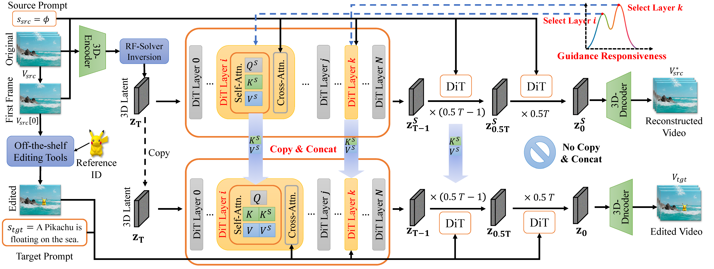

# ContextFlow: Training-Free Video Object Editing via Adaptive Context Enrichment

<p align="center">
  <a href="https://arxiv.org/abs/2509.17818"></a>
  <a href="https://yychen233.github.io/ContextFlow-page"></a>
  <a href="https://github.com/Wan-Video/Wan2.1"></a>
</p>

<p align="center">
  <strong>Yiyang Chen<sup>1</sup>, Xuanhua He<sup>2*</sup>, Xiujun Ma<sup>1*</sup>, Jack Ma<sup>2*</sup></strong><br>
  <sup>1</sup>State Key Laboratory of General Artificial Intelligence, Peking University<br>
  <sup>2</sup>The Hong Kong University of Science and Technology
</p>

<p align="center">
  
</p>

## 📖 Abstract

**ContextFlow** is a novel **training-free** framework for DiT-based video object editing, supporting **object insertion**, **swapping**, and **deletion**. Built upon [Wan2.1-I2V-14B-480P](https://github.com/Wan-Video/Wan2.1), our method introduces three key innovations:

1. **High-Fidelity Inversion via RF-Solver**: A second-order Rectified Flow solver replaces lossy DDIM Inversion, establishing a near-lossless and highly reversible noise anchor for editing.
2. **Adaptive Context Enrichment (ACE)**: Instead of crude "hard" feature replacement, ACE concatenates Key-Value pairs from parallel reconstruction and editing paths, enabling the self-attention to dynamically fuse source and target information without contextual conflicts.
3. **Vital Layer Analysis via Guidance Responsiveness**: A data-driven metric identifies the most influential DiT blocks for each task, enabling targeted and efficient guidance injection.

Extensive experiments demonstrate that ContextFlow **significantly outperforms existing training-free methods** and even **surpasses several state-of-the-art training-based approaches**.

---

## 🔥 News

- **[2026.03]** 🎉 Paper and code released!

---

## 📑 Table of Contents

- [Method Overview](#-method-overview)
- [Installation](#-installation)
- [Model Preparation](#-model-preparation)
- [Inference](#-inference)
  - [Step 1: Video Inversion](#step-1-video-inversion)
  - [Step 2: Object Editing](#step-2-object-editing)
- [Results](#-results)
- [Citation](#-citation)
- [Acknowledgements](#-acknowledgements)

---

## 🔬 Method Overview

<p align="center">
  
</p>

### 1. High-Fidelity Inversion

We adopt **RF-Solver**, a second-order Rectified Flow solver, to map the source video to a noise latent `z_T`. Unlike first-order DDIM Inversion, RF-Solver provides near-lossless reconstruction, creating an unambiguous anchor for editing.

### 2. Adaptive Context Enrichment (ACE)

During denoising, we maintain two parallel paths from the shared `z_T`:
- **Reconstruction Path**: Conditioned on the original first frame and null prompt, preserving source context.
- **Editing Path**: Conditioned on the edited first frame and target prompt, synthesizing the desired edit.

At selected layers, we **concatenate** Key-Value pairs from both paths:

```
K_aug = Concat([K_edit, K_recon])
V_aug = Concat([V_edit, V_recon])
Attention = softmax(Q_edit · K_aug^T / √d) · V_aug
```

This "soft guidance" empowers the model to dynamically balance between content preservation and object synthesis on a per-token basis—without destructive feature replacement.

### 3. Vital Layer Analysis

We propose a **Guidance Responsiveness (GR)** metric to identify the most influential layers for each task:

| Task      | Dominant Responsive Layers          | Interpretation               |
| --------- | ----------------------------------- | ---------------------------- |
| Insertion | Early layers (1–10)                 | Spatial layout establishment |
| Swapping  | Deep layers (26–32)                 | Semantic concept replacement |
| Deletion  | Middle + Deep layers (15–21, 26–32) | Dual semantic operation      |

Only the top-k (k=4) most responsive layers receive context enrichment, ensuring both precision and efficiency.

---

## 🛠 Installation

ContextFlow is built on top of [Wan2.1](https://github.com/Wan-Video/Wan2.1). Please follow the official Wan2.1 environment setup first.

### 1. Clone this repository

```bash
git clone https://github.com/yychen233/ContextFlow.git
cd ContextFlow
```

### 2. Install Wan2.1 dependencies

```bash
# Ensure PyTorch >= 2.4.0
pip install -r requirements.txt
```

> 💡 For detailed environment setup and troubleshooting, please refer to the [Wan2.1 Official Repository](https://github.com/Wan-Video/Wan2.1).

## 📦 Model Preparation

### Base Model

Download the **Wan2.1-I2V-14B-480P** checkpoint, which serves as our base model:

| Model               | Download                                                     | Notes                    |
| ------------------- | ------------------------------------------------------------ | ------------------------ |
| Wan2.1-I2V-14B-480P | [🤗 HuggingFace](https://huggingface.co/Wan-AI/Wan2.1-I2V-14B-480P) / [🤖 ModelScope](https://modelscope.cn/models/Wan-AI/Wan2.1-I2V-14B-480P) | Required for ContextFlow |

```bash
pip install "huggingface_hub[cli]"
huggingface-cli download Wan-AI/Wan2.1-I2V-14B-480P --local-dir ./Wan2.1-I2V-14B-480P
```

### First-Frame Editing Tools

ContextFlow uses off-the-shelf image editors to prepare the edited first frame. Depending on the task, you may need:

| Task             | Tool           | Link                                                      |
| ---------------- | -------------- | --------------------------------------------------------- |
| Object Insertion | AnyDoor        | [GitHub](https://github.com/ali-vilab/AnyDoor)            |
| Object Swapping  | InsertAnything | [GitHub](https://github.com/song-wensong/insert-anything) |
| Object Deletion  | MagicQuill     | [GitHub](https://github.com/magic-quill/MagicQuill)       |

---

## 🚀 Inference

ContextFlow follows a simple **two-stage** pipeline. Since our method is entirely **training-free**, no fine-tuning or optimization is required.

### Step 1: Video Inversion

First, invert the source video into a noise latent using RF-Solver:

```bash
bash inversion.sh
```

> ⚙️ **Key parameters:**
> - **Inversion steps**: 50
> - **Solver**: RF-Solver (second-order)
>
> Please modify the paths in `inversion.sh` to point to your source video and model checkpoint.

> 💡 **Pre-inverted noise available**: We provide pre-computed noise latents for demo videos. Download from:
> [📁 PKU Cloud Drive](https://disk.pku.edu.cn/link/AAA0018652ED064235B4DF8E376C983E85)
>
> If using the pre-inverted noise, you can skip this step and proceed directly to Step 2.

### Step 2: Object Editing

With the inverted noise latent ready, run the corresponding demo script for your desired task:

#### 🟢 Object Insertion

```bash
bash demo_insert.sh
```

Insert a new object into the video while preserving the original background and motion.

#### 🔵 Object Swapping

```bash
bash demo_swap.sh
```

Replace an existing object with a new one, maintaining spatial layout and temporal coherence.

#### 🔴 Object Deletion

```bash
bash demo_delete.sh
```

Remove an object from the video and seamlessly inpaint the background.

> ⚠️ **Important**: Please update the file paths in each script (e.g., model checkpoint, source video, edited first frame, inverted noise, and target prompt) before running.

### Default Hyperparameters

| Parameter                | Value               | Description                                            |
| ------------------------ | ------------------- | ------------------------------------------------------ |
| `num_inference_steps`    | 50                  | Denoising sampling steps                               |
| `guidance_scale`         | 3.0                 | Classifier-free guidance scale                         |
| `τ` (timestep threshold) | 0.5                 | ACE active for the first 50% of timesteps              |
| `k` (vital layers)       | 4                   | Top-k layers selected by GR metric (~10% of 40 layers) |
| Base model               | Wan2.1-I2V-14B-480P | 40-layer Diffusion Transformer                         |

---


## 📊 Results

### Quantitative Comparison

| Task       | Method   | CLIP-I ↑   | DINO-I ↑   | CLIP-score ↑ | Smoothness ↑ | Dynamic ↑  | Aesthetic ↑ |
| ---------- | -------- | ---------- | ---------- | ------------ | ------------ | ---------- | ----------- |
| **Insert** | AnyV2V   | 0.5943     | 0.4053     | 0.2776       | 0.9804       | 0.3077     | 0.5287      |
|            | VACE     | 0.5683     | 0.3967     | 0.2569       | 0.9921       | 0.3077     | 0.5724      |
|            | I2VEdit  | 0.6710     | 0.4595     | 0.3124       | 0.9827       | 0.3077     | 0.5846      |
|            | **Ours** | **0.6504** | **0.4566** | **0.3107**   | **0.9918**   | **0.4231** | **0.6227**  |
| **Swap**   | AnyV2V   | 0.6046     | 0.5641     | 0.3210       | 0.9848       | 0.0769     | 0.5739      |
|            | VACE     | 0.6080     | 0.5917     | 0.3226       | 0.9926       | 0.1538     | 0.6144      |
|            | I2VEdit  | 0.6683     | 0.6003     | 0.3282       | 0.9819       | 0.0769     | 0.5995      |
|            | **Ours** | **0.6644** | **0.6004** | **0.3391**   | **0.9924**   | 0.0769     | **0.6176**  |
| **Delete** | AnyV2V   | –          | –          | 0.2891       | 0.9781       | 0.1500     | 0.5378      |
|            | VACE     | –          | –          | 0.2794       | 0.9889       | 0.3000     | 0.5645      |
|            | **Ours** | –          | –          | **0.2854**   | **0.9900**   | **0.3500** | 0.5405      |

> Evaluated on the [UNIC-Benchmark](https://arxiv.org/abs/2506.04216). Video quality metrics from [VBench](https://github.com/Vchitect/VBench).

### Qualitative Results

<p align="center">
  
</p>

> For more video results, please visit our [🌐 Project Page](https://yychen233.github.io/ContextFlow-page).

---

## 📂 Project Structure

```
ContextFlow/
├── inversion.sh              # Video inversion script (RF-Solver)
├── demo_insert.sh            # Object insertion demo
├── demo_swap.sh              # Object swapping demo
├── demo_delete.sh            # Object deletion demo
├── requirements.txt          # Dependencies (Wan2.1 base)
├── assets/                   # README images
├── examples/                 # Example inputs (videos, edited frames)
└── ...                       # Core source code
```

---

## 📜 Citation

If you find ContextFlow useful in your research, please consider citing:

```bibtex
@inproceedings{chen2026contextflow,
  title={ContextFlow: Training-Free Video Object Editing via Adaptive Context Enrichment},
  author={Chen, Yiyang and He, Xuanhua and Ma, Xiujun and Ma, Jack},
  booktitle={Proceedings of the AAAI Conference on Artificial Intelligence},
  year={2026}
}
```

Also consider citing the base model:

```bibtex
@article{wan2025,
  title={Wan: Open and Advanced Large-Scale Video Generative Models},
  author={Team Wan and Ang Wang and Baole Ai and others},
  journal={arXiv preprint arXiv:2503.20314},
  year={2025}
}
```

---

## 🙏 Acknowledgements

We gratefully acknowledge the following projects that made this work possible:

- [Wan2.1](https://github.com/Wan-Video/Wan2.1) — Our base I2V Diffusion Transformer model
- [RF-Solver](https://github.com/wangjiangshan0725/RF-Solver-Edit) — High-fidelity Rectified Flow inversion
- [AnyDoor](https://github.com/ali-vilab/AnyDoor) — First-frame editing for object insertion
- [InsertAnything](https://github.com/song-wl/InsertAnything) — First-frame editing for object swapping
- [MagicQuill](https://github.com/magic-quill/MagicQuill) — First-frame editing for object deletion
- [AnyV2V](https://github.com/TIGER-AI-Lab/AnyV2V) — Training-free video editing baseline
- [VBench](https://github.com/Vchitect/VBench) — Video generation evaluation benchmark

---

## 📄 License

This project is released under the [Apache 2.0 License](LICENSE). The base model Wan2.1 is also licensed under Apache 2.0. Please ensure your usage complies with all applicable licenses and legal regulations.

---

<p align="center">
  <i>If you have any questions, feel free to open an issue or contact us at <a href="mailto:chenyy@stu.pku.edu.cn">chenyy@stu.pku.edu.cn</a>.</i>
</p>
